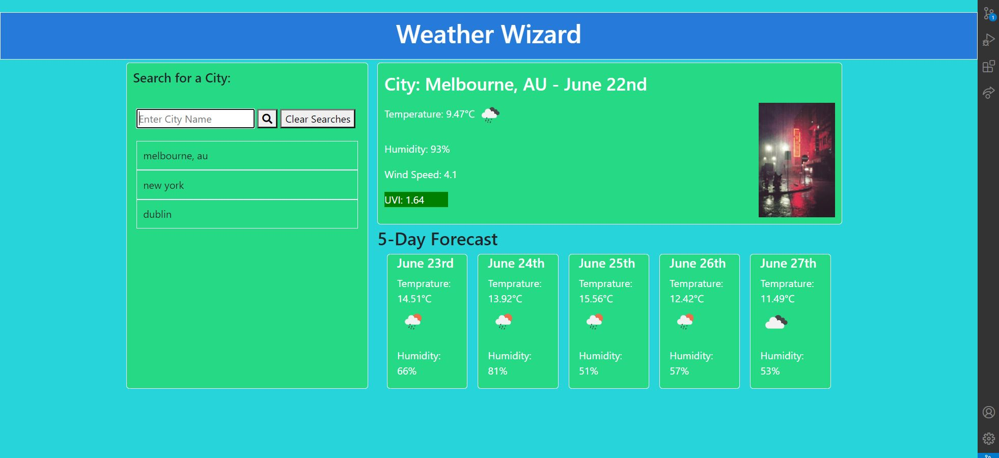

## Weather Dashboard

## Description 

Got Tasked with creating a website utilising the api openweather map, to run searches and display various information about a city and display its information correctly.

## Breakdown

I had a lot more fun with this project than some of the others, things seemed to come together a little easier whether thats information finally sinking in, or the projects complexity is up for debate.

I didn't struggle as much with finding a path, i was able to phedo code steps for myself to follow and work on little chunks of the project one step at a time, i hard coded the html first before moving onto the dynamic steps, giving myself a much better frame to work with. Utilising tricks the instructors have show us, such as treating new elements as objects allowed me to write my code in a much easier to understand way. 

## Usage 

You can make a search via the text box and either use enter or click on the search button to run the search function, it will automatically create a list of the previously searched cities in a sidebar, if you click on any of these entries it will re-run a search for that city as well.

I've included a small gif in the corner of each main weather screen to lighten up the whole aspect of the website, giving some interesting results. 

The weather is displayed for the current day, displaying the name and country, alongside its current date. The temp for the day, a little icon representing the type of weather, the humidity and the uv index. Which changes its background color depending on the severity of the uv light your most likely to come across.

## Links And Images

https://ben-j-st.github.io/hw6-weather-dashboard/
 